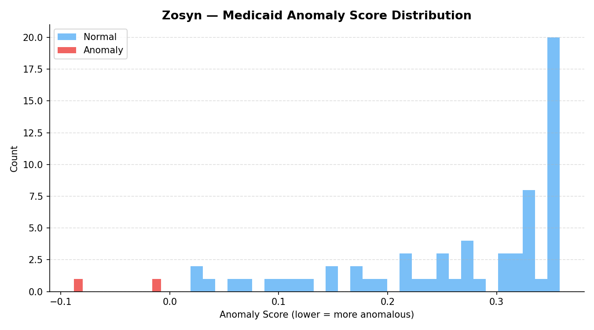
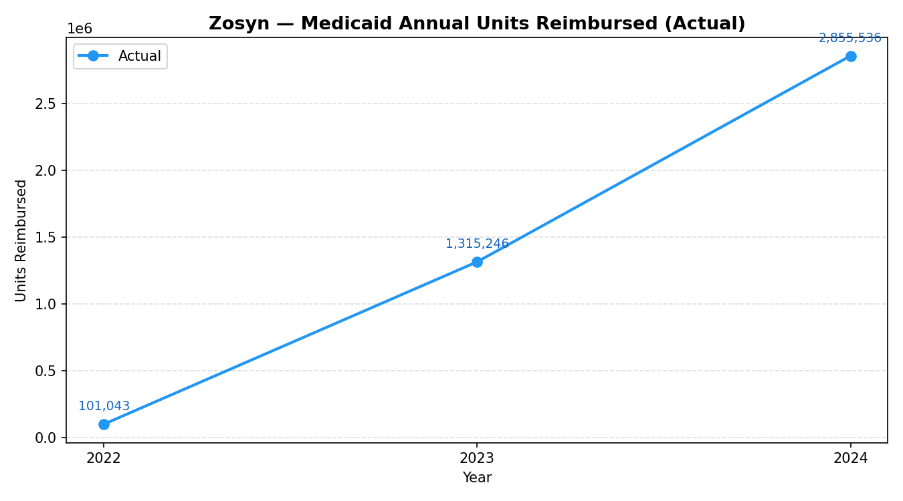
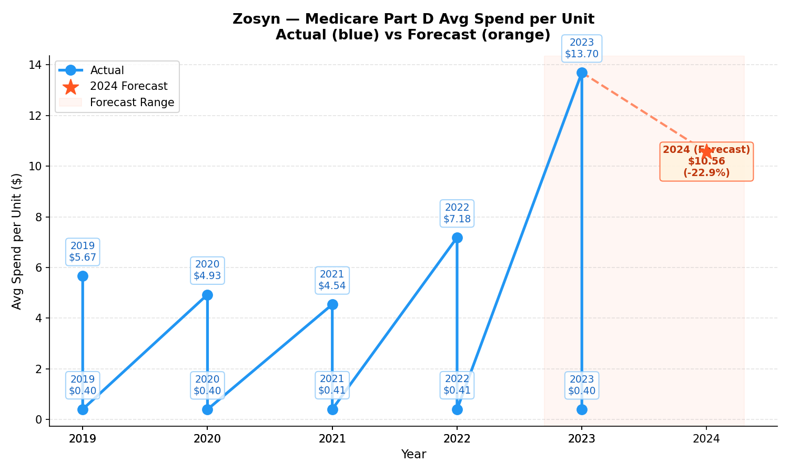

🌐 GovRx Analytics Platform
End-to-end analytics on real CMS Medicaid & Medicare drug data

---

# Overview

GovRx Analytics Platform is a **multiple-file Python pipeline** built to analyze real **CMS Medicaid Drug Utilization** and **Medicare Part B/D datasets**.

It processes raw government data into structured insights through:

- Data ingestion and cleaning
- Feature engineering
- Gold-layer analytical tables
- Anomaly detection
- Price-trend forecasting
- Risk scoring
- Visualizations
- Streamlit dashboard
- A lightweight AI assistant

The project focuses on **drug-level utilization, spending patterns, and year-over-year changes across U.S. government programs.**

---

# Key Capabilities

## Data Processing

- Chunk-based ingestion for large Medicaid files  
- Dynamic schema handling for inconsistent CMS formats  
- Wide-to-long transformation for Medicare Part D  
- Bronze -> Silver -> Gold data lake structure  

---

## Feature Engineering

- Medicaid utilization, reimbursement, and YoY growth
- Medicare spending, unit cost, and beneficiary metrics
- Derived indicators such as:
  - amount-per-unit
  - amount-per-prescription

---

## Modeling

- Isolation Forest for detecting abnormal utilization patterns
- Random Forest / Linear Regression for forecasting next-year spend-per-unit
- Risk scoring combining utilization, spending, and growth metrics

---

## Outputs

The pipeline generates:

- Drug-level utilization and spending trends
- High-risk drug ranking
- Forecasted price movement
- Anomaly flags
- Visual summaries and charts
- Interactive dashboard for exploration
- Command-line AI assistant for metric explanations

### Anomaly score distribution  



### Medicaid units by year  


### Medicare_part_d_forecast_plot  


---

# Data Sources

All datasets come directly from **CMS (Centers for Medicare & Medicaid Services)**:

- **Medicaid Drug Utilization (SDUD)** — 2022, 2023, 2024
- **Medicare Part B Drug Spending**
- **Medicare Part D Drug Spending** (wide format converted to long format)

These datasets reflect **real U.S. government program activity** and are widely used in:

- Drug pricing
- Government contracting
- Healthcare analytics
- Market access strategy

---

# Project Structure

```

govrx_full_pipeline.py      # Single-file end-to-end pipeline

data/
cms/                      # Raw CMS files
bronze/                   # Cleaned data
silver/                   # Feature tables
gold/                     # Final analytical tables

models/                     # Saved ML models

reports/
figures/                  # Generated plots

````

# Tech Stack

* Python
* Pandas
* Scikit-learn
* Streamlit
* Matplotlib
* CMS Public Data

---

# Example Analytics Questions

This platform helps answer questions such as:

* Which drugs show abnormal utilization growth?
* Which medications have the highest government spending risk?
* What drugs are likely to increase price next year?
* How do Medicare and Medicaid spending patterns differ?

---

# Future Enhancements

Planned improvements include:

* LLM-powered analytics explanations
* Automated CMS dataset updates
* Advanced forecasting models
* Drug-class level analysis
* Contract pricing simulation

## ▶️ Disclaimer

The analysis is based on publicly available government data. All rights to the underlying data belong to the original source. The interpretations and conclusions expressed herein are solely those of the author and do not imply any endorsement or opposition regarding any company or product. This content is for learning and non-commercial purposes only and does not constitute medical or professional advice.
